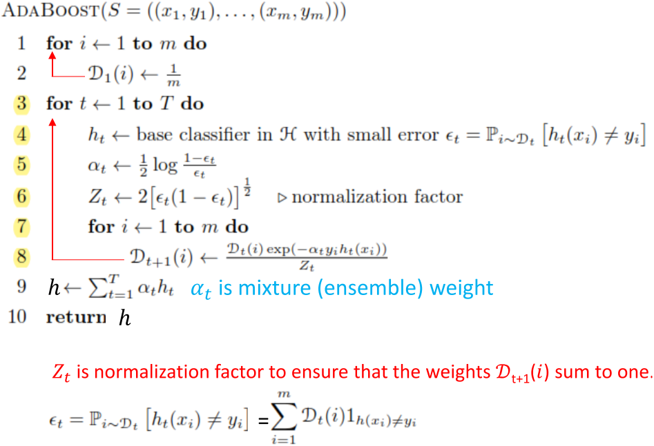

# AdaBoost-Implementation

This is an implementation of AdaBoost for binary classification. This algorithm uses multiple weak hypotheses together to build a more robust hypothesis. For the base hypothesis, I used stump with the help of DessicionTreeClassifire from sklearn library. You can also see the algorithm in the following figure :

## Reference
Foundations of Machine Learning, 2nd Ed., By Mehryar Mohri, , Afshin Rostamizadeh, Ameet Talwalkar, Publisher: MIT Press, 2018
